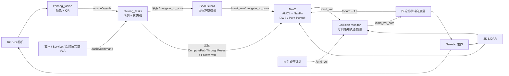

# 系统架构

## 总体闭环



## ROS 包

| 包 | 职责 |
|---|---|
| `zhirong_description` | 四轮滑移转向底盘、LiDAR、RGB-D 的 URDF/Xacro |
| `zhirong_gazebo` | 离线可加载世界、静态/动态障碍、颜色和二维码标志 |
| `zhirong_vision` | OpenCV 颜色识别、pyzbar 二维码解码、稳定事件 |
| `zhirong_tasks` | 文本命令、任务队列、状态机、重试、取消、巡航、返航 |
| `zhirong_bringup` | 仿真、SLAM、Nav2、安全监控和完整系统 Launch |

## 速度安全链

所有控制源都发布 `/cmd_vel`，Collision Monitor 根据 `/scan` 和当前速度预测
车体未来 `1.2 s` 的扫掠轨迹：

```text
/cmd_vel → 轨迹碰撞预测 → /cmd_vel_safe → Gazebo 差速驱动插件
```

前进轨迹即将碰撞时速度会被压低直至停止；只要旋转扫掠范围或后退路径安全，
转向和后退不会因“前方有点云”而被整体清零。

## 目标与有限脱困

公共 `/navigate_to_pose` 只有 Goal Guard 一个服务端。它先检查全局代价地图，
要求目标周围至少 `0.34 m` 无致命障碍且不包含未知区域，再转发到内部
`/nav2_raw/navigate_to_pose`。

多点巡航由任务管理器直接调用 `ComputePathThroughPoses` 生成途经全部航点的
全局路径，再用巡航专用 `Regulated Pure Pursuit` 跟踪。前三个航点连续通过，
在回家方向的交接点切换为最后一段同向直线路径；进入 `home` 的 `0.18 m`
范围后取消尾段并平滑停车。普通单点导航仍使用 DWB 和上述 Goal Guard。

导航确实被临时障碍困住时，行为树最多执行两段恢复：清理代价地图并安全后退
`0.20 m`，随后安全旋转 `45°`。仍无法规划就明确失败，不会无限重试。

## 视觉触发安全语义

视觉任务默认不授权，系统启动后不会因为看到标志而自行运动。

用户调用 `/tasks/arm_vision` 或输入 `vision on` 后，只允许第一个能够匹配
任务表的视觉事件触发任务。触发后立即自动撤权，防止返航途中再次看到其他
标志而形成连锁任务。

## 扩展边界

- 语音识别、VLA/VLM 只需把结构化文本发到 `/tasks/command`。
- 新导航站点和巡航路线集中配置在 `zhirong_tasks/config/tasks.yaml`。
- 机械臂应作为独立 Action/Service 接入任务层，不修改底盘控制链。
- 实体底盘可复用 `/cmd_vel_safe`、`/odom`、`/scan` 和 Nav2 接口，但必须
  单独完成实车参数标定与安全验收。
